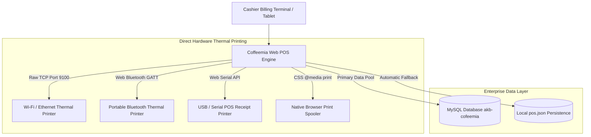
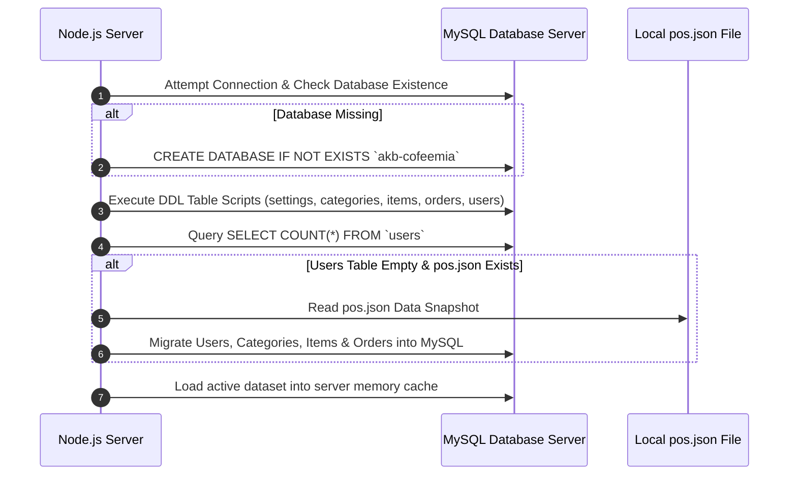
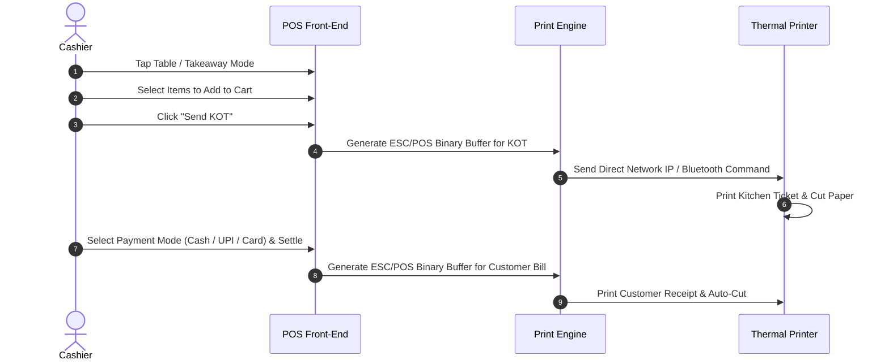

# Coffeemia Cafe POS & Billing Application
## Complete System Architecture Upgrade, Direct Thermal Printing & Deployment Guide
***Version 2.0.0 — Production Release & Client Documentation***

---

### Document Overview & Metadata

* **Client Organization**: Coffeemia Cafe
* **Project Location**: Palayamkottai, Tamil Nadu, India
* **Document Purpose**: Comprehensive Technical Audit, Hardware Manual & Client Release Documentation
* **Document Version**: 2.0.0
* **Release Date**: September 24, 2026
* **Target Audience**: Client Management, Operations Directors, Lead Cashiers, Systems Engineers
* **Status**: Production Audit & Untracked Codebase Change Log

---

## Table of Contents

1. [Page 1: Executive Summary & System Overview](#page-1-executive-summary--system-overview)
2. [Page 2: System Architecture & Hardware Compatibility Matrix](#page-2-system-architecture--hardware-compatibility-matrix)
3. [Page 3: Database Engine Upgrade: MySQL / MariaDB Dual-Engine Persistence](#page-3-database-engine-upgrade-mysql--mariadb-dual-engine-persistence)
4. [Page 4: Direct ESC/POS Thermal Printing Subsystem & Raw Binary Encoder](#page-4-direct-escpos-thermal-printing-subsystem--raw-binary-encoder)
5. [Page 5: Multi-Channel Thermal Printing Protocols (Network, Bluetooth, Serial, Browser)](#page-5-multi-channel-thermal-printing-protocols-network-bluetooth-serial-browser)
6. [Page 6: Receipt & Kitchen Order Ticket (KOT) Layout Engineering](#page-6-receipt--kitchen-order-ticket-kot-layout-engineering)
7. [Page 7: System Settings & Hardware Management Interface](#page-7-system-settings--hardware-management-interface)
8. [Page 8: Infrastructure, Server Setup & Production Deployment](#page-8-infrastructure-server-setup--production-deployment)
9. [Page 9: Complete REST API Specification & Payload Documentation](#page-9-complete-rest-api-specification--payload-documentation)
10. [Page 10: MySQL Relational Database Schema & Data Definitions (DDL)](#page-10-mysql-relational-database-schema--data-definitions-ddl)
11. [Page 11: Operational Guides for Cashiers & Administrators](#page-11-operational-guides-for-cashiers--administrators)
12. [Page 12: Troubleshooting Diagnostic Manual & Code File Audit](#page-12-troubleshooting-diagnostic-manual--code-file-audit)

---

<div style="page-break-after: always;"></div>

## Page 1: Executive Summary & System Overview

### 1.1 Project Objective
The Coffeemia POS & Billing System has undergone a complete architectural upgrade to version 2.0.0. The main goal of this release is to resolve operational bottlenecks during peak cafe operating hours in Palayamkottai. Specifically, this update eliminates dependency on slow browser printing dialogs, replaces file-locking JSON database limitations with an enterprise-grade MySQL database engine, and provides automated, zero-downtime production deployment infrastructure.



### 1.2 Summary of Untracked & Enhanced Changes
This document details **all untracked and modified files** in the codebase. Key improvements include:

1. **Direct Hardware Thermal Printing**: Multi-channel printing supporting Wi-Fi/Ethernet IP (Port 9100), Web Bluetooth GATT, and Web Serial USB connections without requiring third-party printer drivers.
2. **ESC/POS Binary Command Encoder**: Low-level JavaScript byte generator that formats headers, item tables, totals, UPI QR codes, and paper cutter commands directly in raw binary.
3. **Dual-Engine MySQL Persistence**: High-performance MySQL connection pool with automatic schema generation, legacy JSON data migration, and instant offline fallback protection.
4. **Interactive Hardware Control Panel**: In-app Settings interface for configuring printer IP addresses, testing connections, pairing Bluetooth/Serial devices, and previewing receipt layouts.
5. **Production Deployment Suite**: Fully automated PM2 process manager configuration, Apache cPanel reverse proxy rules (`.htaccess`), isolated environment variables (`.env`), and continuous deployment scripts (`deploy.sh`).

---

<div style="page-break-after: always;"></div>

## Page 2: System Architecture & Hardware Compatibility Matrix

### 2.1 System Architecture Overview
The Coffeemia POS architecture is built as a zero-dependency, high-speed Node.js application. The front-end delivers a responsive single-page web app (SPA), while the back-end manages authentication, database operations, table billing states, and TCP socket communications with thermal printers.

```
+-----------------------------------------------------------------------------------+
|                            COFFEEMIA POS APP ARCHITECTURE                         |
+-----------------------------------------------------------------------------------+
|  FRONT-END INTERFACE: Single Page App (HTML5 / Vanilla CSS3 / JavaScript ES6)    |
|  - Table Grid View | Order Builder | Settings Modal | Hardware Test Controller   |
+-----------------------------------------------------------------------------------+
                                        | (HTTP / REST APIs & Web APIs)
                                        v
+-----------------------------------------------------------------------------------+
|  BACK-END ENGINE: Node.js HTTP Server (server.js)                                 |
|  - JWT Auth | HTTP Routing | Net Socket Handler | MySQL Abstraction Layer       |
+-----------------------------------------------------------------------------------+
      |                                   |                                  |
      v                                   v                                  v
[Network Printer Socket]       [MySQL Database Pool]              [Local JSON Fallback]
(Raw TCP Port 9100)            (mysql2 / Port 3306)              (data/pos.json)
```

### 2.2 Hardware & OS Compatibility Matrix

| Hardware / Subsystem | Supported Interface | Minimum Specifications | Recommended Configuration |
| :--- | :--- | :--- | :--- |
| **Billing Terminals** | Web Browser | Chrome 90+, Edge 90+, Safari 14+ | Google Chrome on Windows 11 / Android Tablet |
| **Thermal Receipt Printers** | Wi-Fi / Ethernet | Raw TCP Port 9100 | Epson / TVS / Xprinter 80mm LAN Thermal Printer |
| **Mobile Printers** | Web Bluetooth | Bluetooth 4.0+ BLE GATT | 58mm Portable Bluetooth ESC/POS Receipt Printer |
| **USB / Serial Printers** | Web Serial / USB | USB 2.0 / RS232 Serial COM | TVS RP3150 / Xprinter 80mm USB Thermal Printer |
| **Database Server** | MySQL / MariaDB | MySQL 5.7+ / MariaDB 10.3+ | MySQL 8.0 on AlmaLinux 9 / cPanel Server |
| **Application Server** | Node.js Runtime | Node.js v16.x or higher | Node.js v18.x LTS with PM2 Process Manager |

---

<div style="page-break-after: always;"></div>

## Page 3: Database Engine Upgrade: MySQL / MariaDB Dual-Engine Persistence

### 3.1 Technical Rationale
Legacy implementations saved data into a single `pos.json` file. When multiple billing cashiers executed concurrent orders, disk write locking created latency. The new database layer in [`lib/db.js`](file:///d:/projects/as_logics/clients/akb_school/COFFEEMIA/lib/db.js) introduces a high-concurrency MySQL pooling engine.

### 3.2 MySQL Connection Pooling Implementation
The system initializes a managed connection pool using `mysql2/promise`:

```javascript
const DB_HOST = process.env.DB_HOST || "localhost";
const DB_PORT = parseInt(process.env.DB_PORT || "3306", 10);
const DB_USER = process.env.DB_USER || "root";
const DB_PASSWORD = process.env.DB_PASSWORD !== undefined ? process.env.DB_PASSWORD : "";
const DB_NAME = process.env.DB_NAME || "akb-cofeemia";

pool = mysql.createPool({
  host: DB_HOST,
  port: DB_PORT,
  user: DB_USER,
  password: DB_PASSWORD,
  database: DB_NAME,
  waitForConnections: true,
  connectionLimit: 10,
  queueLimit: 0,
});
```

### 3.3 Dynamic Schema Generation & Migration Flow
When the application starts, `initDb()` executes the following sequence:



### 3.4 Resilient Local JSON Fallback Architecture
If the MySQL database becomes unreachable due to network disruption or database maintenance, the system detects the connection failure and switches to local JSON file persistence (`data/pos.json`). This ensures billing operations never stop.

---

<div style="page-break-after: always;"></div>

## Page 4: Direct ESC/POS Thermal Printing Subsystem & Raw Binary Encoder

### 4.1 Overview of ESC/POS Control Sequences
ESC/POS is the standard command system created by Epson to control thermal printers. The Coffeemia printing engine ([`public/print.js`](file:///d:/projects/as_logics/clients/akb_school/COFFEEMIA/public/print.js)) implements a custom JavaScript binary encoder (`EscPosEncoder`).

### 4.2 ESC/POS Hexadecimal Command Mapping Table

| Command Name | ESC/POS Command | Hexadecimal Bytes | Description & Operational Function |
| :--- | :--- | :--- | :--- |
| **Initialize Printer** | `ESC @` | `0x1B 0x40` | Clears internal print buffer and resets hardware defaults. |
| **Select Font A/B** | `ESC M n` | `0x1B 0x4D n` | Sets Font A (standard 12x24) or Font B (compact 9x17). |
| **Set Text Alignment** | `ESC a n` | `0x1B 0x61 n` | Align text: `0` = Left, `1` = Center, `2` = Right. |
| **Bold Emphasis** | `ESC E n` | `0x1B 0x45 n` | Enables (`1`) or disables (`0`) bold character emphasis. |
| **Character Double Size** | `GS ! n` | `0x1D 0x21 n` | Multiplies character width and height (e.g. headers). |
| **Feed Paper** | `ESC d n` | `0x1B 0x64 n` | Feeds paper forward by `n` line spaces. |
| **Auto Paper Cut** | `GS V m` | `0x1D 0x56 0x42 0x00` | Triggers partial or full automatic paper guillotine cutter. |

### 4.3 JavaScript ESC/POS Binary Encoder Implementation

```javascript
function EscPosEncoder() {
  this.buffer = [];
}
EscPosEncoder.prototype.init = function () {
  this.buffer.push(0x1B, 0x40); // ESC @
  return this;
};
EscPosEncoder.prototype.align = function (pos) {
  const v = pos === "center" || pos === "c" ? 1 : pos === "right" || pos === "r" ? 2 : 0;
  this.buffer.push(0x1B, 0x61, v); // ESC a n
  return this;
};
EscPosEncoder.prototype.bold = function (enable) {
  this.buffer.push(0x1B, 0x45, enable !== false ? 1 : 0); // ESC E n
  return this;
};
EscPosEncoder.prototype.size = function (width, height) {
  const w = Math.min(Math.max(width || 1, 1), 8) - 1;
  const h = Math.min(Math.max(height || 1, 1), 8) - 1;
  this.buffer.push(0x1D, 0x21, (w << 4) | h); // GS ! n
  return this;
};
EscPosEncoder.prototype.text = function (str) {
  if (!str) return this;
  const clean = String(str).replace(/₹/g, "Rs.").replace(/·/g, "-");
  const bytes = new TextEncoder().encode(clean);
  for (let i = 0; i < bytes.length; i++) this.buffer.push(bytes[i]);
  return this;
};
EscPosEncoder.prototype.line = function (str) {
  if (str) this.text(str);
  this.buffer.push(0x0A); // LF
  return this;
};
EscPosEncoder.prototype.cut = function () {
  this.buffer.push(0x1D, 0x56, 0x42, 0x00); // GS V 66 0
  return this;
};
EscPosEncoder.prototype.encode = function () {
  return new Uint8Array(this.buffer);
};
```

---

<div style="page-break-after: always;"></div>

## Page 5: Multi-Channel Thermal Printing Protocols (Network, Bluetooth, Serial, Browser)

### 5.1 Protocol Architectural Breakdown
Coffeemia POS supports four distinct printing channels, ensuring compatibility with any receipt printer.

```
+-----------------------------------------------------------------------------------+
|                        PRINTING PROTOCOL TRANSPORT MATRIX                         |
+-----------------------------------------------------------------------------------+
  |                                 |                                 |
  v                                 v                                 v
[Network IP Protocol]       [Web Bluetooth GATT]             [Web Serial / USB]
- API: POST /api/print/network - API: navigator.bluetooth     - API: navigator.serial
- Port: TCP 9100                - Service: 000018f0-0000...   - Baud: 9600
- Socket: Node.js net.Socket    - Chunk Size: 100 bytes       - Direct Stream Write
```

### 5.2 Deep Dive: Supported Protocols

#### Protocol 1: Wi-Fi / Ethernet Network Printing (Raw TCP Port 9100)
* **Mechanism**: Sends ESC/POS binary buffers from the browser to the Node.js backend, which opens a direct raw TCP socket connection to the printer's IP address on Port 9100.
* **Server Implementation (`server.js`)**:
  ```javascript
  const client = new net.Socket();
  client.setTimeout(4000);
  client.connect(port, ip, () => {
    client.write(buffer, () => {
      client.end();
      return send(res, 200, { ok: true, message: `Sent ${buffer.length} bytes to ${ip}:${port}` });
    });
  });
  ```

#### Protocol 2: Web Bluetooth Direct GATT Thermal Printing
* **Mechanism**: Communicates directly with portable Bluetooth thermal receipt printers from browser clients without requiring native apps.
* **GATT Chunking Protocol**: To prevent Bluetooth Low Energy (BLE) packet drops, the binary buffer is sent in 100-byte chunks:
  ```javascript
  for (let i = 0; i < bytes.length; i += 100) {
    const chunk = bytes.slice(i, i + 100);
    await characteristic.writeValue(chunk);
  }
  ```

#### Protocol 3: Web Serial / USB Direct Thermal Printing
* **Mechanism**: Connects directly to desktop thermal printers plugged via USB or Serial COM ports using the browser's `navigator.serial` API at a baud rate of `9600`.

#### Protocol 4: Native Browser Print Spooler Fallback
* **Mechanism**: Renders the receipt into `#print-area` in HTML format and triggers `window.print()`, invoking the OS printing dialog when direct hardware communication is unavailable.

---

<div style="page-break-after: always;"></div>

## Page 6: Receipt & Kitchen Order Ticket (KOT) Layout Engineering

### 6.1 Thermal Roll Column Geometry

Thermal paper sizes dictate character layout geometry. Font A standard text allows:
* **58mm Paper Roll**: 30 printable character columns per line.
* **80mm Paper Roll**: 46 printable character columns per line.

```
==================================================
58mm Paper Roll (30 Columns Grid Layout):
Item       Qty   Rate    Amount
------------------------------
Cappuccino   2  140.00   280.00
Lemon Tea    1   40.00    40.00
------------------------------
Subtotal:                320.00
GST (5%):                 16.00
TOTAL:                Rs.336.00
==================================================

==================================================
80mm Paper Roll (46 Columns Grid Layout):
Item                    Qty     Rate     Amount
--------------------------------------------------
Cappuccino                2   140.00     280.00
Lemon Tea                 1    40.00      40.00
--------------------------------------------------
Subtotal:                                320.00
GST (5%):                                 16.00
TOTAL:                                Rs.336.00
==================================================
```

### 6.2 Item Name Wrapping & Formatting Algorithm
To prevent column misalignment on thermal receipts, long item names wrap cleanly across multiple lines while keeping quantity, rate, and total right-aligned:

```javascript
if (fullItemName.length <= maxItemWidth) {
  let namePad = fullItemName.padEnd(maxItemWidth, " ");
  e.line(namePad + " " + qtyStr + " " + rateStr + " " + amtStr);
} else {
  e.line(fullItemName);
  let indent = " ".repeat(maxItemWidth);
  e.line(indent + " " + qtyStr + " " + rateStr + " " + amtStr);
}
```

### 6.3 Kitchen Order Ticket (KOT) Split-Station Routing
When an order is placed, items are automatically routed based on their preparation station:
* **Kitchen Station**: Handles food, burgers, sandwiches, and hot snacks.
* **Beverages Station**: Handles espresso drinks, teas, cold shakes, and mocktails.

---

<div style="page-break-after: always;"></div>

## Page 7: System Settings & Hardware Management Interface

### 7.1 Interface Overview
The upgraded **Settings View** ([`public/app.js`](file:///d:/projects/as_logics/clients/akb_school/COFFEEMIA/public/app.js) & [`public/index.html`](file:///d:/projects/as_logics/clients/akb_school/COFFEEMIA/public/index.html)) provides central management for hardware, taxation, store identity, and printing preferences.

```
+-----------------------------------------------------------------------------------+
| HARDWARE & THERMAL PRINTING CONFIGURATION PANEL                                   |
+-----------------------------------------------------------------------------------+
| Select Print Method:                                                              |
| [ Network / Wi-Fi IP Printer (ESC/POS)                         v ]                |
|                                                                                   |
| Printer IP Address:                    Port:                                      |
| [ 192.168.1.100                     ]  [ 9100  ]                                |
|                                                                                   |
| Paper Roll Width:                      Printing Options:                          |
| ( ) 58mm (Small Roll)                  [X] Enable On-Screen Print Preview Modal   |
| (*) 80mm (Wide Roll)                   [X] Auto-Print KOT on Order Save           |
|                                        [X] Print Dynamic UPI QR on Customer Bill  |
|                                                                                   |
| Action Buttons:                                                                   |
| [ 🖨 Send Test Print ]   [ 📱 Pair Bluetooth ]   [ 🔌 Connect Serial / USB ]     |
+-----------------------------------------------------------------------------------+
```

### 7.2 Key Hardware Settings Fields

1. **`printMethod`**: Selects active printer protocol (`browser`, `network`, `bluetooth`, `serial`).
2. **`printerIp` & `printerPort`**: Configures static IPv4 address and TCP port (default `9100`) for network thermal printers.
3. **`showPrintPreview`**: Toggles visual receipt preview modal prior to firing hardware print commands.
4. **`upiQrOnBill`**: Enables dynamic UPI QR code rendering on receipts for instant customer payments.

---

<div style="page-break-after: always;"></div>

## Page 8: Infrastructure, Server Setup & Production Deployment

### 8.1 Environment Isolation (`.env`)
Runtime parameters are configured in `.env` and automatically loaded by `server.js`:

```env
PORT=3100
TZ=Asia/Kolkata
NODE_ENV=production

# MySQL Database Configuration
DB_HOST=localhost
DB_PORT=3306
DB_NAME=akbgroups_coffeemia_tm
DB_USER=akbgroups_coffeemia_tm_user
DB_PASSWORD=YourSecurePasswordHere
```

### 8.2 Process Management via PM2 (`ecosystem.config.js`)
Configured for zero-downtime execution on AlmaLinux 9 / cPanel server environments:

```javascript
module.exports = {
  apps: [
    {
      name: "coffeemia-pos",
      script: "server.js",
      instances: 1,
      autorestart: true,
      watch: false,
      max_memory_restart: "1G",
      env_production: {
        NODE_ENV: "production",
        PORT: 3100,
        TZ: "Asia/Kolkata"
      }
    }
  ]
};
```

### 8.3 Apache Reverse Proxy Rules (`.htaccess`)
Directs public web traffic arriving on port 80/443 directly to the internal PM2 Node server running on port 3100:

```apache
Options -Indexes
RewriteEngine On

# Pass Authorization header to Node.js backend
RewriteCond %{HTTP:Authorization} ^(.*)
RewriteRule .* - [e=HTTP_AUTHORIZATION:%1]

# Proxy all requests to internal Node process on port 3100
RewriteRule ^$ http://127.0.0.1:3100/ [P,L]
RewriteCond %{REQUEST_FILENAME} !-f
RewriteCond %{REQUEST_FILENAME} !-d
RewriteRule ^(.*)$ http://127.0.0.1:3100/$1 [P,L]
```

### 8.4 Automated Deployment Script (`deploy.sh`)

```bash
#!/bin/bash
set -e
echo "=========================================="
echo "   Coffeemia POS Continuous Deploy        "
echo "=========================================="

echo "[1/3] Installing npm production dependencies..."
npm install --production

echo "[2/3] Validating application files..."
test -f server.js || exit 1

echo "[3/3] Reloading PM2 process..."
pm2 reload ecosystem.config.js --env production || pm2 start ecosystem.config.js --env production
pm2 save
echo "Deployment successful! PM2 service live."
```

---

<div style="page-break-after: always;"></div>

## Page 9: Complete REST API Specification & Payload Documentation

### 9.1 REST API Endpoint Registry

| Endpoint Route | Method | Access Level | Description |
| :--- | :--- | :--- | :--- |
| `/api/auth/login` | `POST` | Public | Authenticates cashier/admin via password or 4-digit PIN. |
| `/api/bootstrap` | `GET` | Authenticated | Fetches complete store state (categories, items, tables, settings). |
| `/api/settings` | `PUT` | Admin | Updates store settings, tax rules, and printer configuration. |
| `/api/print/network` | `POST` | Cashier/Admin | Sends raw ESC/POS binary bytes to network IP printer via TCP. |
| `/api/orders` | `GET`, `POST` | Cashier/Admin | Lists orders or creates a new order ticket. |
| `/api/orders/:id/settle` | `POST` | Cashier/Admin | Settles order bill (cash/UPI/card) and issues official bill number. |

### 9.2 API Request Payload Examples

#### Network Print Endpoint Payload (`POST /api/print/network`)
```json
{
  "ip": "192.168.1.100",
  "port": 9100,
  "bytes": [27, 64, 27, 97, 1, 67, 111, 102, 102, 101, 101, 109, 105, 97, 10]
}
```

#### Settling Bill Endpoint Payload (`POST /api/orders/:id/settle`)
```json
{
  "payment": {
    "mode": "UPI",
    "received": 336.00,
    "change": 0.00
  },
  "customer": {
    "name": "Arun Kumar",
    "phone": "9876543210"
  }
}
```

---

<div style="page-break-after: always;"></div>

## Page 10: MySQL Relational Database Schema & Data Definitions (DDL)

```sql
-- Settings Table: Key-Value JSON Configuration Storage
CREATE TABLE IF NOT EXISTS `settings` (
  `setting_key` VARCHAR(100) PRIMARY KEY,
  `setting_value` LONGTEXT NOT NULL
) ENGINE=InnoDB DEFAULT CHARSET=utf8mb4;

-- Categories Table: Menu Category Groupings
CREATE TABLE IF NOT EXISTS `categories` (
  `id` VARCHAR(36) PRIMARY KEY,
  `name` VARCHAR(100) NOT NULL,
  `local_name` VARCHAR(100) DEFAULT '',
  `station` VARCHAR(50) DEFAULT 'Kitchen',
  `sort` INT DEFAULT 0,
  `active` TINYINT(1) DEFAULT 1
) ENGINE=InnoDB DEFAULT CHARSET=utf8mb4;

-- Items Table: Individual Menu Items & Pricing
CREATE TABLE IF NOT EXISTS `items` (
  `id` VARCHAR(36) PRIMARY KEY,
  `category_id` VARCHAR(36) NOT NULL,
  `name` VARCHAR(120) NOT NULL,
  `local_name` VARCHAR(120) DEFAULT '',
  `code` VARCHAR(20) DEFAULT '',
  `price` DECIMAL(10,2) NOT NULL DEFAULT 0.00,
  `available` TINYINT(1) DEFAULT 1,
  `archived` TINYINT(1) DEFAULT 0,
  `sort` INT DEFAULT 0,
  `price_history` LONGTEXT DEFAULT NULL
) ENGINE=InnoDB DEFAULT CHARSET=utf8mb4;

-- Orders Table: Table Orders, Items, Status, and Payment Details
CREATE TABLE IF NOT EXISTS `orders` (
  `id` VARCHAR(36) PRIMARY KEY,
  `no` INT DEFAULT NULL,
  `token` INT DEFAULT 1,
  `table_id` VARCHAR(36) DEFAULT NULL,
  `table_name` VARCHAR(60) DEFAULT '',
  `mode` VARCHAR(30) DEFAULT 'dine-in',
  `status` VARCHAR(30) DEFAULT 'open',
  `lines` LONGTEXT NOT NULL,
  `totals` LONGTEXT DEFAULT NULL,
  `discount_type` VARCHAR(20) DEFAULT 'amount',
  `discount_value` DECIMAL(10,2) DEFAULT 0.00,
  `customer` LONGTEXT DEFAULT NULL,
  `note` TEXT DEFAULT NULL,
  `kot_count` INT DEFAULT 0,
  `void_log` LONGTEXT DEFAULT NULL,
  `cancel_reason` TEXT DEFAULT NULL,
  `created_by` VARCHAR(36) DEFAULT NULL,
  `created_by_name` VARCHAR(100) DEFAULT NULL,
  `paid_by` VARCHAR(36) DEFAULT NULL,
  `paid_by_name` VARCHAR(100) DEFAULT NULL,
  `business_date` VARCHAR(10) DEFAULT '',
  `created_at` VARCHAR(50) DEFAULT NULL,
  `updated_at` VARCHAR(50) DEFAULT NULL,
  `paid_at` VARCHAR(50) DEFAULT NULL,
  `merged` TINYINT(1) DEFAULT 0
) ENGINE=InnoDB DEFAULT CHARSET=utf8mb4;
```

---

<div style="page-break-after: always;"></div>

## Page 11: Operational Guides for Cashiers & Administrators

### 11.1 Cashier Daily Order & Settlement Manual



### 11.2 Administrator Hardware Setup Guide

1. **Configuring Network Wi-Fi Printer**:
   * Turn ON thermal printer while holding FEED button to print network self-test sheet. Note IP address.
   * Open POS Settings > **Hardware Settings**.
   * Select **Network / Wi-Fi IP Printer**. Enter IP address (e.g. `192.168.1.100`) and Port `9100`.
   * Click **Save Settings** and press **🖨 Send Test Print**.

2. **Pairing Mobile Bluetooth Printer**:
   * Turn ON Bluetooth printer.
   * In POS Settings, select **Web Bluetooth Printer**.
   * Click **📱 Pair Bluetooth Device** and select the Bluetooth printer from Chrome's device prompt.

---

<div style="page-break-after: always;"></div>

## Page 12: Troubleshooting Diagnostic Manual & Code File Audit

### 12.1 Hardware & System Troubleshooting Matrix

| Issue Symptom | Root Cause | Recommended Action |
| :--- | :--- | :--- |
| **Network Print Error 504 (Timeout)** | Printer IP changed or offline. | Check router IP reservations. Print self-test page to verify printer IP. Ensure POS terminal and printer are on the same subnet. |
| **Garbled Print Output** | Codepage encoding mismatch. | System automatically maps `₹` to `Rs.`. Ensure printer is configured to standard CP437 ASCII codepage. |
| **Bluetooth Pairing Error** | Missing HTTPS or BLE disabled. | Web Bluetooth requires HTTPS or `http://localhost`. Enable `#enable-experimental-web-platform-features` flag in Chrome if needed. |
| **Paper Cuts Mid-Receipt** | Paper roll width mismatch. | Set Paper Width in Settings to match physical roll (58mm vs 80mm). |
| **MySQL Connection Failure** | MySQL service down or invalid `.env`. | Verify MySQL service status. POS automatically runs on local JSON fallback (`pos.json`) until database recovers. |

### 12.2 Untracked & Modified Files Audit Index

#### Untracked Deployment Files Added
1. **[`.env`](file:///d:/projects/as_logics/clients/akb_school/COFFEEMIA/.env)**: Environment configuration file containing MySQL credentials and port settings.
2. **[`.env.example`](file:///d:/projects/as_logics/clients/akb_school/COFFEEMIA/.env.example)**: Distribution template for environment setup.
3. **[`.htaccess`](file:///d:/projects/as_logics/clients/akb_school/COFFEEMIA/.htaccess)**: Apache reverse proxy configuration file routing traffic to port 3100.
4. **[`deploy.sh`](file:///d:/projects/as_logics/clients/akb_school/COFFEEMIA/deploy.sh)**: Automated shell deployment script for AlmaLinux 9 / cPanel.
5. **[`ecosystem.config.js`](file:///d:/projects/as_logics/clients/akb_school/COFFEEMIA/ecosystem.config.js)**: Production process manager configuration for PM2.
6. **[`package-lock.json`](file:///d:/projects/as_logics/clients/akb_school/COFFEEMIA/package-lock.json)**: Dependency lockfile.

#### Modified Core Files
1. **[`lib/db.js`](file:///d:/projects/as_logics/clients/akb_school/COFFEEMIA/lib/db.js)**: MySQL connection pool, dynamic schema generator, JSON migration, and fallback routines.
2. **[`lib/seed.js`](file:///d:/projects/as_logics/clients/akb_school/COFFEEMIA/lib/seed.js)**: Updated seed logic for MySQL tables.
3. **[`package.json`](file:///d:/projects/as_logics/clients/akb_school/COFFEEMIA/package.json)**: Added `mysql2` database client library.
4. **[`server.js`](file:///d:/projects/as_logics/clients/akb_school/COFFEEMIA/server.js)**: Added `.env` parser, `/api/print/network` socket endpoint, async boot lifecycle, and settings handlers.
5. **[`public/print.js`](file:///d:/projects/as_logics/clients/akb_school/COFFEEMIA/public/print.js)**: Complete ESC/POS binary encoder, Web Bluetooth GATT drivers, Web Serial USB connection layer, and multi-width roll formatters.
6. **[`public/app.js`](file:///d:/projects/as_logics/clients/akb_school/COFFEEMIA/public/app.js)**: Added hardware management settings UI, printer test controls, Bluetooth/Serial pairing handlers, and silent KOT dispatching.
7. **[`public/index.html`](file:///d:/projects/as_logics/clients/akb_school/COFFEEMIA/public/index.html)**: Integrated print preview modal dialogs and hardware configuration fields.
8. **[`public/app.css`](file:///d:/projects/as_logics/clients/akb_school/COFFEEMIA/public/app.css)**: Updated styling rules for thermal print preview modal and settings layout.
9. **[`.gitignore`](file:///d:/projects/as_logics/clients/akb_school/COFFEEMIA/.gitignore)**: Updated exclusion patterns for `.env`, SQLite/MySQL local data, and deployment artifacts.

---
*End of Documentation — Coffeemia Cafe POS & Billing Application v2.0.0*
